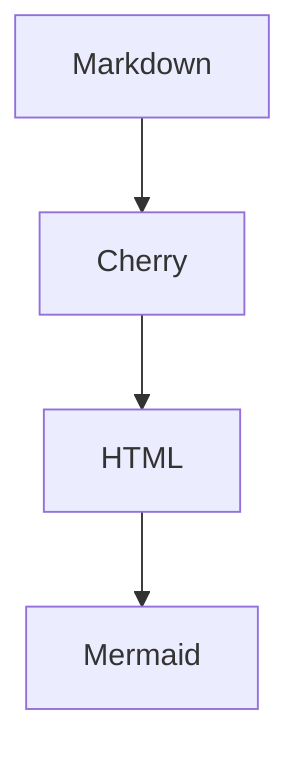

# Full Render Smoke



Inline math: $x^2 + y^2 = z^2$

$$
\sum_{i=1}^{n} i = \frac{n(n+1)}{2}
$$

```echarts
{
  "tooltip": {},
  "xAxis": { "type": "category", "data": ["A", "B", "C"] },
  "yAxis": { "type": "value" },
  "series": [{ "type": "bar", "data": [12, 32, 21] }]
}
```

| Region | Revenue | YoY |
|---|---:|---:|
| North | 120 | +12.5% |
| South | 80 | -4.2% |
